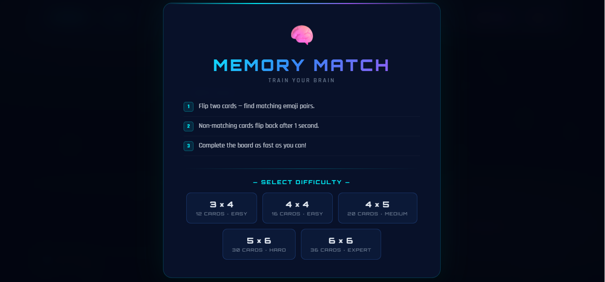
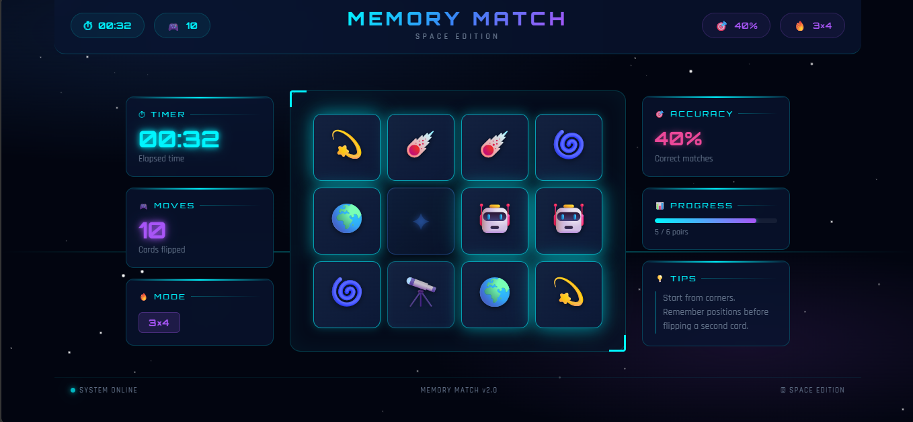
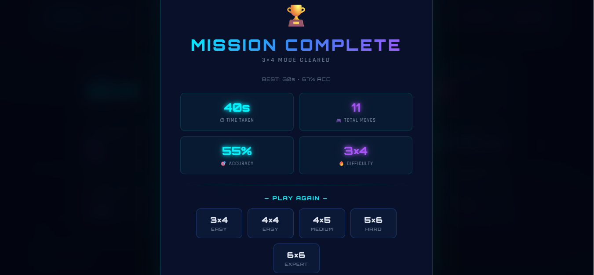

# 🧠 Memory Matching Game

A fun and interactive Memory Matching Game built using **HTML, CSS, and JavaScript**. Test your memory by matching pairs of cards in the least number of moves and shortest time possible.

## 🎮 Features

- 🎴 Randomized card layout every game
- 🔄 Restart game anytime
- ⏱️ Timer to track your performance
- 📊 Move counter
- ✅ Match detection with smooth animations
- 🎉 Victory message when all pairs are matched
- 📱 Responsive design for desktop and mobile

## 🛠️ Built With

- HTML5
- CSS3
- JavaScript (ES6)

## 📸 Screenshot

<p align="center">
  
</p>
<p align="center">
  
</p>
<p align="center">
  
</p>


## 🚀 Getting Started

### Clone the Repository

```bash
git clone https://github.com/your-username/memory-matching-game.git
```

### Open the Project

Simply open the `index.html` file in your browser.

Or use VS Code Live Server for a better development experience.

## 🎯 How to Play

1. Click on any card to reveal it.
2. Click on another card to find its matching pair.
3. If the cards match, they remain open.
4. If they don't match, they flip back after a short delay.
5. Match all pairs to win the game.

## 📂 Project Structure
```
Memory-Matching-Game/
│
├── 📁 Screenshots/
│   ├── Home.png
│   ├── Gameplay.png
│   └── Result.png
│
├── index.html
├── style.css
├── script.js
└── README.md
```
## 🌟 Future Improvements

- Multiple difficulty levels
- Sound effects
- Best score storage using Local Storage
- Dark mode
- Different card themes
- Multiplayer mode

## 🤝 Contributing

Contributions are welcome!

1. Fork the repository
2. Create a new branch
3. Make your changes
4. Commit your changes
5. Open a Pull Request

## 📄 License

This project is licensed under the MIT License.

---

⭐ If you enjoyed this project, consider giving it a star on GitHub!
